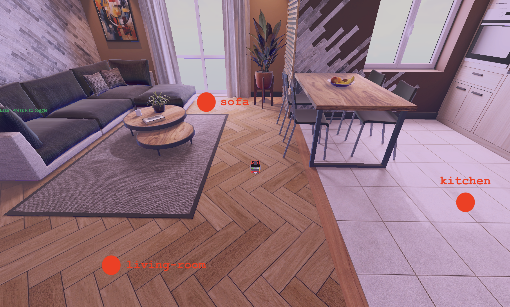

# Checkpoint 21 — FastBot Control Dashboard (Web)

Browser-based ROS 2 control dashboard for the **FastBot** mobile robot. A single-page Vue.js app that connects to a live ROS 2 stack over WebSocket (`rosbridge_suite`) and delivers, from a single browser tab, **a live 2D occupancy map, an animated 3D URDF model, the onboard camera MJPEG stream, a virtual joystick, live pose/velocity telemetry, and three preset navigation waypoints** — no install, just point a browser at `index.html`.

<p align="center">
  
</p>

## Dashboard at a Glance

<p align="center">
  
</p>

```
┌────────────────────────────────────────────────────────────────┐
│  FastBot Control Dashboard                                     │
│  [ rosbridge address ] [ Connect / Disconnect ]  ● Connected   │
├─────────────────┬─────────────────┬────────────────────────────┤
│ Environment Map │ 3D Robot Model  │ Camera Feed                │
│  (ros2djs /map) │ (ros3djs URDF)  │ (MJPEG via web_video_server)│
├─────────────────┼─────────────────┼────────────────────────────┤
│ Robot Status    │ Joystick        │ Navigation Waypoints       │
│ x,y,z, yaw      │ vertical / horiz│ [Living Room] [Sofa]       │
│ lin / ang vel   │ (drag disc)     │ [Kitchen]                  │
└─────────────────┴─────────────────┴────────────────────────────┘
```

Everything the dashboard shows comes from the companion backend repo — see [`fastbot_webapp` backend (ros2_ws)](../../ros2_ws/src/README.md) for the ROS 2 side (Nav2, AMCL, Cartographer, `tf2_web_republisher_py`, `rosbridge_suite`, `web_video_server`).

## Architecture

```
Browser (Vue 2 SPA)                              ROS 2 backend
┌───────────────────────────┐                    ┌────────────────────┐
│  roslib.min.js            │◀── wss:// ────────▶│ rosbridge_suite    │
│  ros3d.min.js (URDF+TF)   │   JSON ROS proto   │ (port 9090)        │
│  ros2d.js (OccupancyGrid) │                    ├────────────────────┤
│  mjpegcanvas /  MJPG │◀── https://cameras │ web_video_server   │
│                           │                    ├────────────────────┤
│  Vue 2 components:        │   /fastbot_1/odom  │ Nav2 stack         │
│  · Connection panel       │   /fastbot_1/cmd_vel│  · planner         │
│  · Map viewer             │   /map             │  · controller (DWB)│
│  · 3D viewer              │   TFSubscription ─▶│ tf2_web_republisher│
│  · Camera viewer          │   action           │ (action server)    │
│  · Status cards           │                    ├────────────────────┤
│  · Joystick               │   /goal_pose       │ bt_navigator       │
│  · Waypoint buttons       │   /navigation_result│                   │
└───────────────────────────┘                    └────────────────────┘
```

## Components

### 1. Connection panel

`ROSLIB.Ros({ url: rosbridge_address, groovyCompatibility: false })`. The `groovyCompatibility: false` flag is mandatory — the companion `tf2_web_republisher_py` backend requires it (ROS 2 action namespace layout). On successful `connection` the app wires up every subscriber, publisher, action client and viewer in one pass:

```js
this.ros.on('connection', () => {
  this.setup3DViewer()
  this.setupMapViewer()
  this.setCamera()
  this.pubInterval = setInterval(this.publish, 100)  // 10 Hz cmd_vel

  this.odomTopic = new ROSLIB.Topic({ ros: this.ros,
      name: '/fastbot_1/odom', messageType: 'nav_msgs/Odometry' })
  this.odomTopic.subscribe(m => { this.position = m.pose.pose.position;
                                   this.orientation = m.pose.pose.orientation })

  this.cmdVelTopic = new ROSLIB.Topic({ ros: this.ros,
      name: '/fastbot_1/cmd_vel', messageType: 'geometry_msgs/Twist' })
  this.cmdVelTopic.subscribe(m => { this.speed.linear  = m.linear.x
                                     this.speed.angular = m.angular.z })

  this.navigateToPoseClient = new ROSLIB.ActionClient({ ros: this.ros,
      serverName: '/navigate_to_pose',
      actionName: 'nav2_msgs/action/NavigateToPose' })
})
```

### 2. Environment Map — `ros2djs` OccupancyGridClient

```js
this.mapViewer = new ROS2D.Viewer({ divID: 'divMapViewer',
                                    width: mapDiv.clientWidth, height: mapDiv.clientHeight })
this.mapClient = new ROS2D.OccupancyGridClient({
    ros: this.ros, rootObject: this.mapViewer.scene,
    topic: '/map', continuous: true })

this.mapClient.on('change', () => {
    const grid = this.mapClient.currentGrid
    this.mapViewer.scaleToDimensions(grid.width, grid.height)
    this.mapViewer.shift(grid.pose.position.x, grid.pose.position.y)  // recenter
})
```

Subscribes to the `/map` topic served by Nav2's `map_server` (loading `fastbot_area.pgm`), auto-scales the canvas to the grid dimensions and **shifts** by the grid origin so (0,0) lands in the middle of the viewport — critical because the apartment map has origin `[-4.07, -4.5, 0]`.

### 3. 3D Robot Model — `ros3djs` + `UrdfClient`

```js
this.viewer = new ROS3D.Viewer({ divID: 'div3DViewer', width: w, height: h,
    background: '#cccccc', fixedFrame: 'fastbot_1_odom', antialias: true })
this.viewer.addObject(new ROS3D.Grid({ color:'#0181c4', cellSize: 0.5, num_cells: 20 }))

this.tfClient = new ROSLIB.TFClient({ ros: this.ros,
    angularThres: 0.01, transThres: 0.01, rate: 10.0,
    fixedFrame: 'fastbot_1_base_link' })   // talks to tf2_web_republisher_py action

this.urdfClient = new ROS3D.UrdfClient({ ros: this.ros,
    param: '/fastbot_1_robot_state_publisher:robot_description',
    tfClient: this.tfClient,
    path: location.origin + location.pathname,    // strip query string
    rootObject: this.viewer.scene,
    loader: ROS3D.COLLADA_LOADER_2 })
```

- `TFClient` talks to the backend `tf2_web_republisher_py` action server (`TFSubscription`). Change thresholds (`0.01 rad`, `0.01 m`) keep network chatter low while still producing smooth animation
- `UrdfClient` reads the URDF from the **parameter server** (not a topic), resolves `package://` URIs against `path`, and renders meshes via the vendored `ColladaLoader2.js` / `STLLoader.js`
- `path: location.origin + location.pathname` strips query params so relative mesh URLs resolve correctly regardless of how the page was opened

Vendored meshes live in `fastbot_description/models/meshes/` which is served alongside `index.html`, so the URDF resolves `package://fastbot_description/...` → `./fastbot_description/...` directly from the web server.

### 4. Camera Feed — MJPEG via `web_video_server`

```js
setCamera: function() {
  const httpsPrefix = this.rosbridge_address
      .replace(/^wss:\/\//, 'https://')
      .split('/rosbridge')[0]
  const streamUrl = `${httpsPrefix}/cameras/stream`
      + `?topic=/fastbot_1/camera/image_raw&width=320&height=240`

  const img = document.createElement('img')
  img.src = streamUrl; img.width = 320; img.height = 240
  document.getElementById('divCamera').appendChild(img)
}
```

Derives the HTTPS base URL from the `wss://.../rosbridge/` address, then renders `/fastbot_1/camera/image_raw` as a standard MJPEG `` element — the simplest possible web-native camera stream (no `mjpegcanvas.min.js` hub required, even though the lib is loaded as a fallback).

### 5. Robot Status card — reactive Vue state

`position` and `orientation` come straight from `/fastbot_1/odom`. Yaw is derived reactively from the quaternion:

```js
computed: {
  yaw() {
    const { x, y, z, w } = this.orientation
    // yaw = atan2( 2*(w*z + x*y), 1 - 2*(y*y + z*z) )
    return Math.atan2(2*(w*z + x*y), 1 - 2*(y*y + z*z))
  }
}
```

`speed.linear` / `speed.angular` mirror the last `cmd_vel` message — so the card shows both externally commanded motion (Nav2) and the joystick's own output.

### 6. Virtual Joystick → `/fastbot_1/cmd_vel`

A pure-CSS 200×200 circle (`#dragstartzone`) + a draggable inner disc. Mouse / touch events map the cursor offset into `[-0.5, +0.5]` vertical/horizontal gain:

```js
setJoystickVals() {
  this.joystick.vertical   = -1 * ((this.y / 200) - 0.5)
  this.joystick.horizontal = -1 * ((this.x / 200) - 0.5)
}

publish() {   // @ 10 Hz
  let topic = new ROSLIB.Topic({ ros: this.ros, name: '/fastbot_1/cmd_vel',
                                  messageType: 'geometry_msgs/Twist' })
  topic.publish(new ROSLIB.Message({
    linear:  { x: this.joystick.vertical, y: 0, z: 0 },
    angular: { x: 0, y: 0, z: this.joystick.horizontal }
  }))
}
```

Released disc → `resetJoystickVals()` zeros both channels, so the robot stops as soon as the user lets go.

### 7. Preset waypoint buttons → `/goal_pose`

Three buttons in the Navigation Waypoints card, each hardcoded to a real location inside `fastbot_area`:

| Button | `(x, y, θ)` target |
|---|---|
| 🛋️ Living Room | `( 1.3, -2.5,  1.5 rad)` |
| 🪑 Sofa | `(-2.0, -0.5,  0.0 rad)` |
| 🍴 Kitchen | `( 1.2,  1.8, -1.5 rad)` |

Implemented by publishing directly on `/goal_pose` (the topic Nav2's `bt_navigator` treats as a `NavigateToPose` trigger), with yaw converted to a quaternion:

```js
navigateToWaypoint(x, y, theta) {
    const qz = Math.sin(theta/2), qw = Math.cos(theta/2)
    const goalTopic = new ROSLIB.Topic({ ros: this.ros,
        name: '/goal_pose', messageType: 'geometry_msgs/PoseStamped' })
    goalTopic.publish(new ROSLIB.Message({
        header: { stamp: {sec:0,nanosec:0}, frame_id: 'map' },
        pose:   { position: {x, y, z: 0},
                  orientation: {x:0, y:0, z: qz, w: qw} }
    }))

    // arrival signalled on /navigation_result (std_msgs/Bool)
    const resultTopic = new ROSLIB.Topic({ ros: this.ros,
        name: '/navigation_result', messageType: 'std_msgs/msg/Bool' })
    // + 10 s topic timeout
}
```

A fallback `navigateToPoseClient` ActionClient (`/navigate_to_pose`, `nav2_msgs/action/NavigateToPose`) is also instantiated at connect-time — available for richer integrations that need cancel / feedback.

## Styling

`styles.css` ships a **glass-morphism dashboard** theme:

- Root palette in CSS custom properties (`--primary`, `--glass-bg`, `--glass-border`, …)
- `backdrop-filter: blur(10px)` on every card + connection panel for the frosted-glass effect
- Gradient primary buttons (`#007bff → #0062cc`), lift-on-hover (`translateY(-2px)`)
- Fully responsive breakpoints at `992 px` (tighten card padding, shrink viewers to `250px`) and `768 px` (collapse stats column, 160×160 joystick)

## Project Structure

```
fastbot_webapp/
├── index.html                      Vue2 single-page layout (Bootstrap 4 + FontAwesome)
├── main.js                         Vue app — connection, viewers, joystick, waypoints
├── styles.css                      glass-morphism dashboard theme
├── libs/                           vendored JS (offline-friendly)
│   ├── roslib.min.js              rosbridge client
│   ├── ros3d.min.js               3D TF + URDF rendering
│   ├── ros2d.js                   2D OccupancyGrid client
│   ├── Three.min.js               WebGL renderer
│   ├── ColladaLoader.js           mesh loader (legacy)
│   ├── ColladaLoader2.js          mesh loader (used by ROS3D.COLLADA_LOADER_2)
│   ├── STLLoader.js               STL mesh support
│   └── mjpegcanvas.min.js         MJPEG stream fallback
├── fastbot_description/            local copy of URDF + meshes (served statically)
└── media/                          README screenshots / gif
```

## How to Use

### Prerequisites

- A running FastBot backend — see [`ros2_ws` backend README](../../ros2_ws/src/README.md) for full setup (Nav2 + Cartographer + AMCL + rosbridge_server + tf2_web_republisher_py + web_video_server)
- A modern browser (Chrome / Firefox / Safari) with WebGL
- Network access to the `rosbridge_websocket` endpoint (default port `9090`)

### Run the dashboard

The app is pure static files — no build step:

```bash
cd webpage_ws/fastbot_webapp
python3 -m http.server 7777
# then open http://localhost:7777/index.html
```

Or serve it via any static host (nginx, GitHub Pages, `npx serve`).

### Connecting

1. Launch the ROS 2 backend (Nav2 + rosbridge + TF bridge + web_video_server) — see [`ros2_ws`](../../ros2_ws/src/README.md)
2. Paste the rosbridge URL into the text field, e.g.
   ```
   wss://i-03b561d5d597a0cbc.robotigniteacademy.com/<slug>/rosbridge/
   ```
3. Click **Connect** — the viewers, camera, joystick and waypoint buttons all light up simultaneously
4. Drag the joystick for manual teleop, or click one of the **Living Room / Sofa / Kitchen** buttons to issue a Nav2 `NavigateToPose` goal

## Companion Repository

- [`ros2_ws` backend stack](../../ros2_ws/src/README.md) — Nav2 + Cartographer + AMCL + URDF + `tf2_web_republisher_py` + `rosbridge_suite` + `web_video_server`. Every topic and action this dashboard consumes is defined and launched there.

## Key Concepts Covered

- **rosbridge_suite** — WebSocket ROS 2 client using `roslib.js` (topics, services, ActionClient)
- **ros3djs + URDF rendering in the browser** — `TFClient` backed by a `tf2_web_republisher` action, `UrdfClient` reading `robot_description` from a ROS param, meshes resolved via `package://` → local path
- **ros2djs `OccupancyGridClient`** — auto-scaling + origin-shift so the map displays correctly regardless of map-server origin
- **`web_video_server` MJPEG streaming** embedded as a plain `` — simplest possible camera card
- **Nav2 integration from the browser** — publishing `/goal_pose` (not the action directly) to trigger the default `bt_navigator` NavigateToPose tree; subscribing to `/navigation_result` for arrival feedback
- **Vue 2 reactive telemetry** — odom + cmd_vel subscriptions populate the UI with no polling
- **Vanilla-JS joystick** — offset → normalized gain → `Twist` at 10 Hz
- **Glass-morphism UI** — `backdrop-filter: blur()` + gradient buttons, fully responsive

## Technologies

- Vue.js 2.6 (CDN, no build step)
- Bootstrap 4.3 + FontAwesome 5
- `roslib.js` (rosbridge client) · `ros3djs` (3D + URDF) · `ros2djs` (occupancy grid)
- `three.js` (WebGL renderer bundled inside ros3d)
- MJPEG via `web_video_server` (served as plain ``)
- Backend: ROS 2 Humble, Nav2, Cartographer, AMCL, `rosbridge_suite`, `tf2_web_republisher_py`, `web_video_server` — see the [`ros2_ws`](../../ros2_ws/src/README.md) companion repo
